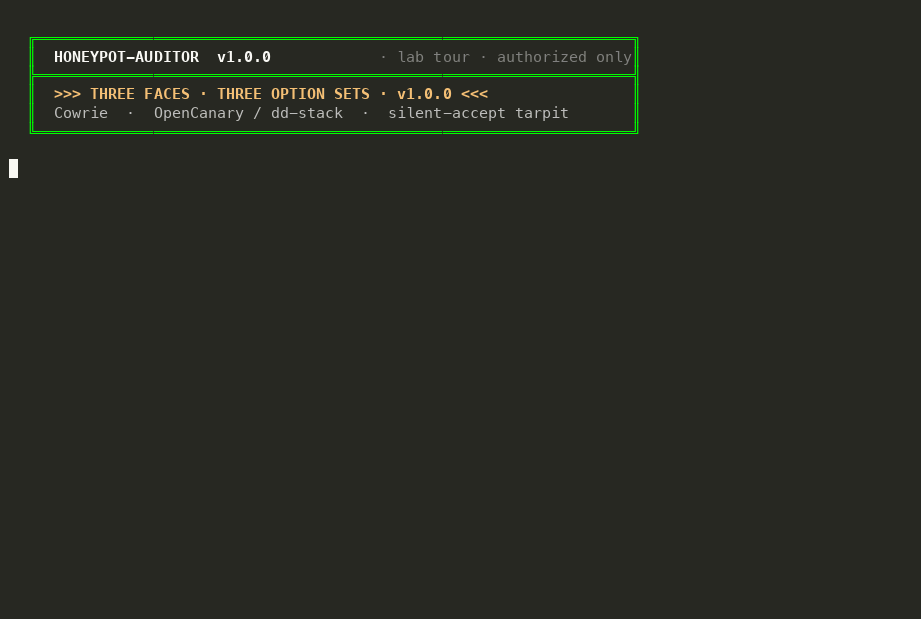

```
.______________________________________________________________________________.
|  :: H-AUDITOR :: v0.7.0 :: "DIALING IN... CARRIER DETECTED" ::                |
|------------------------------------------------------------------------------|
|  "warez? nah. headers. we trade banners, not bins."                          |
|  "if it answers any password, it ain't production — it's a lure."            |
|  "respect the sysop. probe only what you own. leave no STOR behind."         |
|______________________________________________________________________________|
```

[](https://pypi.org/project/honeypot-auditor/)
[](https://pypi.org/project/honeypot-auditor/)
[](https://github.com/mziqudhd92/honeypot-auditor/actions/workflows/test.yml)
[](LICENSE)
[](https://mziqudhd92.github.io/honeypot-auditor/)

**Site (BBS / NFO):** https://mziqudhd92.github.io/honeypot-auditor/  
**Agents / AEO:** [llms.txt](https://mziqudhd92.github.io/honeypot-auditor/llms.txt) · [agents.md](https://mziqudhd92.github.io/honeypot-auditor/agents.md)

```
  ▄▄▄▄▄▄▄▄▄▄▄▄▄▄▄▄▄▄▄▄▄▄▄▄▄▄▄▄▄▄▄▄▄▄▄▄▄▄▄▄▄▄▄▄▄▄▄▄▄▄▄▄▄▄▄▄▄▄▄▄▄▄▄▄▄▄▄▄▄▄▄▄
  █  >>> LIVE DEMO · 3 HOST LAB TOUR · -v / --deep / SILENT-ACCEPT <<<     █
  ▀▀▀▀▀▀▀▀▀▀▀▀▀▀▀▀▀▀▀▀▀▀▀▀▀▀▀▀▀▀▀▀▀▀▀▀▀▀▀▀▀▀▀▀▀▀▀▀▀▀▀▀▀▀▀▀▀▀▀▀▀▀▀▀▀▀▀▀▀▀▀▀
```



```
  "three hosts, three lenses: KEX facade with -v, deep on the buffet,
   silent-accept on the tarpit. same fingerprinter — different tells."
                                              — lab tour · authorized only
```

```
.------------------------------------------------------------------------------.
|  NFO · READ BEFORE YOU DIAL                                                  |
|------------------------------------------------------------------------------|
|  Authorized targets ONLY. Lab boxes. Decoys you own. Sensors you run.        |
|  Permission on paper (or in ticket).                                         |
|                                                                              |
|  Scanning random /16 because Shodan said "interesting" = YOU are the bait.   |
|                                                                              |
|  TYPE ...... Multi-Protocol Decoy Fingerprinter / Lab Util                   |
|  PLATFORM .. Linux · macOS · Windows (Python 3.10+)                          |
|  LICENSE ... MIT · spread the sauce · keep the copyright                     |
|  PYPI ...... pypi.org/project/honeypot-auditor                               |
|  REPO ...... github.com/mziqudhd92/honeypot-auditor                          |
'------------------------------------------------------------------------------'
```

## -=[ WHAT IS THIS ]=-

**Honeypot Auditor** — a CLI that asks one rude question:

> *Does this IP behave like a low-interaction honeypot, or like something
> that might actually bill someone for downtime?*

Passive intel ([Shodan Honeyscore](https://honeyscore.shodan.io/) or explicitly selected providers) plus active,
**non-destructive** probes across the usual decoy faces. Outputs a weighted
**Honeyscore (0–100%)**, Rich console table, versioned JSON report, or SARIF 2.1.0.

Not exploits. Not exfil. Banner/state/auth semantics. The kind of stuff that
made Cowrie sweat in `'09 and still catches clones in `'26.

```
  [ BASIC ]  passive intel · Nmap NSE · SSH/Telnet/SMB/FTP/POP3/HTTP/Redis/SMTP/VNC/SIP
  [ DEEP  ]  shell semantics · OS coherence · HASSH · TCP stack · FSM fuzz
             · co-tenancy buffet detect · latency · latency-under-load · egress bait
             (flag: --deep · more intrusive · same authorization rules)
```

```
  "elite? nah. just consistent timeouts and a honest --confirm-authorized."
```

---

## -=[ INSTALLATION ]=-

```
  ┌─ USERS · PyPI (public index — no pip config voodoo) ─────────────────────┐
  │  python3 -m venv .venv && source .venv/bin/activate   # recommended      │
  │  pip install honeypot-auditor                                            │
  │  pip install "honeypot-auditor[full]"    # + nmap impacket shodan scapy   │
  │  honeypot-auditor --version                                              │
  └──────────────────────────────────────────────────────────────────────────┘
```

| Install | Unlocks |
|---------|---------|
| `pip install honeypot-auditor` | Core probes (Paramiko + Requests + Rich + figlet header) |
| `pip install "honeypot-auditor[full]"` | + Nmap integration · SMB/Impacket · Shodan SDK · Scapy · deep telnet |

`SHODAN_API_KEY` or `--shodan-key` is still **your** key — `[full]` only installs the client lib.
The Nmap executable is a separate trusted system installation.

Windows PowerShell uses `py -m venv .venv` followed by `.\.venv\Scripts\Activate.ps1`.
Raw-socket probes can require Npcap and an elevated terminal; unavailable capabilities are reported and skipped.

**First dial-in:**

```bash
honeypot-auditor --help          # -h, --help, or /help (BBS figlet header)
honeypot-auditor --target 127.0.0.1
```

```
  ┌─ DEVELOPERS · from source ───────────────────────────────────────────────┐
  │  git clone https://github.com/mziqudhd92/honeypot-auditor.git            │
  │  cd honeypot-auditor && python3 -m venv .venv && source .venv/bin/activate│
  │  pip install -e ".[full,dev,security]"                                   │
  │  make test-cov && make lint && make security                             │
  └──────────────────────────────────────────────────────────────────────────┘
```

**No pip install** (git checkout — install minimal deps once):

```bash
pip install -r requirements.txt    # or: pip install rich paramiko requests
python3 honeypot-auditor.py --help
python3 honeypot-auditor.py --target 127.0.0.1
```

`pyfiglet` / `rich-argparse` are optional for the script path (plain header + stdlib help if missing). Full probes need `pip install -e ".[full]"`.

Release maintainers → [docs/PUBLISHING.md](docs/PUBLISHING.md)

---

## -=[ QUICKSTART / COMMANDS ]=-

```bash
# local lab · default probes IANA + docker/lab ports (22 and 2222, 80 and 8081, …)
honeypot-auditor --target 127.0.0.1

# go deep · six extra detection axes · still no exploits
honeypot-auditor --target 127.0.0.1 --deep

# internet-facing target · need explicit ack + Shodan key if you want intel
honeypot-auditor --target 203.0.113.10 --confirm-authorized

# named passive-intel provider · runs only when explicitly selected
HONEYPOT_AUDITOR_INTEL_EXAMPLE_KEY=... honeypot-auditor --target 203.0.113.10 \
  --intel-provider example --confirm-authorized

# SSH 22 only (does not scan the rest of the preset)
honeypot-auditor --target 203.0.113.10 -p 22 --confirm-authorized

# subnet sweep · IPv4 CIDR up to /24 (254 hosts) · parallel by default
honeypot-auditor --target 192.168.1.0/24 --scan-concurrency 16 \
  --confirm-authorized
# subnet JSON → honeypot-audit-subnet-192.168.1.0_24.json (summary + per-host reports)

# benchmark lab · cowrie + dionaea in docker
./scripts/benchmark-lab.sh
```

---

## -=[ STRATEGIES ]=-

Honeyscore adds triggered **category weights**. **Different categories stack** (e.g. static 20% + state 25% = 45%).

**Multi-protocol corroboration** — when basic tells fire on more than one protocol, each protocol beyond the first adds **+5%**, capped at **+35%**. Example: telnet static + ftp state → 20 + 25 + 5 = **50% Suspected**. Deny-all buffets with ≥5 protocol lures can also trigger **co-tenancy** (15%) once another tell corroborates.

```
  ╭──────────────────────────┬────────╮
  │ CATEGORY                 │ WEIGHT │
  ├──────────────────────────┼────────┤
  │ Passive intel            │  25%   │
  │ Arbitrary auth           │  30%   │
  │ State non-persistence    │  25%   │
  │ Static signature         │  20%   │
  │ Co-tenancy               │  15%   │
  ╰──────────────────────────┴────────╯

  CORROBORATION BONUS (dynamic):
    +5% per protocol with a basic-strategy hit, from the 2nd protocol up, max +35%

  --deep ADDS (on top of basic):
  ┌──────────────────────────┬────────┐
  │ behavior                 │  18%   │
  │ coherence                │  15%   │
  │ stack_fingerprint        │  12%   │
  │ proto_conformance        │  12%   │
  │ temporal                 │  10%   │
  └──────────────────────────┴────────┘

  VERDICT BANDS:
    [##########----------]  < 30%   LIKELY REAL HOST
    [################----]  30-59%  SUSPECTED HONEYPOT
    [####################]  >= 60%  CONFIRMED HONEYPOT
```

The protocol table’s **Strategies** column counts only the three probe strategies per face (up to 3).
Shodan and co-tenancy are host-level. Co-tenancy will not fire alone on multi-lure research stacks.

---

## -=[ CLI FLAGS ]=-

```
  -h, --help, /help          show options (figlet H-AUDITOR header + Rich help)
  --version                  print version and exit
  --target HOST              IP, hostname, or IPv4 CIDR (max /24)
  --scan-concurrency N       parallel hosts for CIDR scans (default 8; Shodan skipped)
  --preset both              IANA + lab ports (default: SSH 22 and 2222, …)
  --preset iana              well-known ports only (22, 80, 445, …)
  --preset docker-research   lab ports only (2222, 8081, 1445, …)
  -p, --port 22              only these TCP ports (nmap-style; 22,2222 or -p 22 -p 80)
  --ports ssh=2222,http=8081 per-protocol override (map unused protos to =9)
  --shodan-key KEY           or env SHODAN_API_KEY
  --intel-provider NAME      opt in to a named passive-intel plugin (repeatable)
  --intel-key NAME=KEY       provider key; prefer HONEYPOT_AUDITOR_INTEL_<NAME>_KEY
  --output report.json       JSON path (subnet default: honeypot-audit-subnet-<cidr>.json)
  --confirm-authorized       REQUIRED if any scanned IP is public
  -v, --verbose              strategy breakdown, per-protocol matrix, indicators, notes
  -n, --with-nmap            run Nmap -sV / NSE phase (slow; off by default)
  --deep                     advanced six-axis probes
  --safe-mode                handshake-only; disables deep shell/path probes
  --profile audit|blend       probe profile (default audit; blend=mimesis OPSEC)
  --proxy socks5h://host:port  SOCKS5 egress (remote DNS enforced)
  --passive-first            passive intel before active; skip active when score high
  --osint-only               passive intel only — no TCP probes
  --dual-stack               resolve A+AAAA and compare IPv4 vs IPv6
  --jitter 0.3               fraction of timeout as max random delay (authorized OPSEC)
  --jitter-ms 50-500         random delay range in ms before each probe (authorized OPSEC)
  --max-concurrent 32        global socket concurrency budget
  --seed N                   RNG seed for blend profile
  --preset deception-audit   blue-team QA preset (both ports + --deep)
  --format json|sarif        report format (default json)
  --output-nmap-exclude path append IP when Honeyscore >= 60
  check-sig PATH             validate declarative signature pack offline
  --timeout SECS             socket timeout (default 3)
```

---

## -=[ SUPPORTED PROTOCOLS / PORTS ]=-

**17** protocol engines in the current version. Each uses up to **3** probe
strategies (arbitrary auth · state non-persistence · static signature). The
**Strategies** column is how many of those three are active for that protocol in
this release — not Shodan, co-tenancy, or individual indicator checks.

Default preset (`--preset both`) probes IANA well-known ports **and** common
lab/docker aliases on the same faces. Override ports with `-p` / `--ports`.
Closed faces are skipped, not scored.

| Protocol | Default ports (iana · lab) | Strategies |
|----------|---------------------------:|:----------:|
| SSH | 22 · 2222 | 3 |
| Telnet | 23 · 2323 | 3 |
| FTP | 21 · 2121 | 3 |
| SMTP | 25 · 2525 | 3 |
| POP3 | 110 · 1110 | 3 |
| Redis | 6379 · 6379 | 3 |
| SMB | 445 · 1445 | 2 |
| VNC | 5900 · 5000 | 2 |
| MySQL | 3306 · 3306 | 2 |
| Postgres | 5432 · 5432 | 2 |
| RDP | 3389 · 3389 | 2 |
| MSSQL | 1433 · 1433 | 2 |
| MongoDB | 27017 · 27017 | 2 |
| HTTP | 80 / 443 · 8081 | 1 |
| SIP | 5060 · 5060 | 1 |
| Git | 9418 · 9418 | 1 |
| HTTP proxy | 3128 · 8080 | 1 |

`-p` maps well-known extras the same way: `443`/`8443` → HTTP (TLS), `8080`/`3128` → HTTP proxy, `139` → SMB, `5061` → SIP, `5000`/`5901` → VNC. Unknown numbers are probed as SSH.

The POP3 engine checks response framing, pre-authentication state boundaries, unknown-command handling, and repeated synthetic logins. It never lists, reads, retrieves, or deletes mail; see [RFC 1939](https://www.rfc-editor.org/rfc/rfc1939.html).

`--deep` adds cross-protocol axes (shell semantics, HASSH/TCP stack, FSM fuzz, co-tenancy, serial + concurrent-load latency) on top of the basic strategies above. Passive-intel providers and Nmap NSE (`-n`) are optional layers, not protocol engines.

---

## -=[ DEV / QA ]=-

```bash
make install && make test-cov && make lint && make security
docker compose -f deploy/docker-compose.benchmark.yml up -d
./scripts/benchmark-lab.sh
```

Re-record the animated demos → [docs/demo/README.md](docs/demo/README.md)

Contributing → [CONTRIBUTING.md](CONTRIBUTING.md)

---

## -=[ NOT THE SAME AS UHBS ]=-

This tool asks: **"Is that IP a honeypot?"** (attacker / CTI view)

[UHBS](https://github.com/uhbs/uhbs-standard) asks: **"How good is your decoy?"**
(builder / lab UHQS grade · Modules A–F · 36 protocols)

Same neighborhood. Different door. Use both if you build deception for a living.
Use this one if you just need a fast external fingerprint.

---

## -=[ GREETS / SHOUTS ]=-

<pre>
  Proper respect to:
    Cowrie · Dionaea · Conpot · the old Kippo crew
    <a href="https://uhbs.github.io/uhbs-standard/">UHBS lab rats</a> · <a href="https://cyberhallucinet.org/">CyberHalluciNet</a> purple-team night shift
    Shodan · Salesforce HASSH · everyone who ever typed USER anonymous
    BBS sysops who ran 9600 baud file areas for "utilz"
    and the three people who still read NFO files in 2026
    <a href="https://github.com/fusiontechstrategies">@fusiontechstrategies</a> — POP3, intel plugins, scoring/SARIF, Windows+security CI (v0.7.0)

  NO GREETS TO:
    script kiddies scanning /0
    vendors who call Cowrie "AI-powered threat intelligence"
    anyone who STORs malware on decoys then writes a LinkedIn post about it
</pre>

```
  "greetz to the elite · no greetz to the lame · hang up clean."
```

---

## -=[ RESPONSIBLE USE ]=-

Defensive research. Authorized testing. Lab sandboxes. Your sensors. Your tickets.

Do **not** point this at infrastructure you don't own or haven't been cleared to test.

Vuln reports → [SECURITY.md](SECURITY.md)

---

## -=[ LICENSE ]=-

<pre>
  <a href="LICENSE">MIT</a> · do what you want · keep the copyright · no warranty
  see <a href="LICENSE">LICENSE</a> for the lawyer-safe version (boring but binding)
</pre>

```
.------------------------------------------------------------------------------.
|  h0n3yp0t 4ud1t0r · v0.7.0 · spread headers not malware · EOF · NO CARRIER   |
'------------------------------------------------------------------------------'
```
