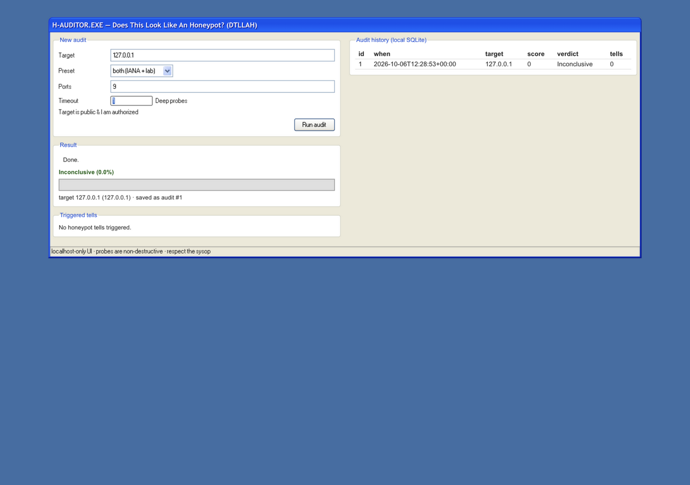

# Beginner tutorial: the local web UI

Run honeypot-auditor from a browser with a Windows-XP-styled control panel
([XP.css](https://github.com/botoxparty/XP.css)). The UI is a small HTTP server
that runs **on your machine, bound to `127.0.0.1` only** — it is never reachable
from your network — and every audit it runs is saved to a local SQLite database
you can browse later.

**Time:** about 5 minutes · **Skill level:** beginner

> **Safety.** The UI can audit anything you type into it. Same rules as the
> CLI: only probe hosts and ports you own or have written permission to test.
> The server cannot be exposed to other machines — it has no option to bind a
> public interface.



---

## 1. Install

The web server ships inside the normal package — nothing extra to install:

```bash
python3 -m venv .venv && source .venv/bin/activate   # Windows: .venv\Scripts\Activate.ps1
pip install "honeypot-auditor[full]"

honeypot-auditor --version   # 1.1.0 or newer (the UI shipped in 1.1.0)
```

From a git checkout instead? `pip install -e ".[full]"` gives you the same
entry point.

## 2. Start the server

```bash
honeypot-auditor serve
```

```
honeypot-auditor UI → http://127.0.0.1:8337  (localhost only, Ctrl+C to stop)
```

Open the printed address in any local browser. A different port:

```bash
honeypot-auditor serve --port 9000
```

Stop with **Ctrl+C**.

## 3. Run your first audit

The main window has three panels:

| Panel | What it does |
|-------|--------------|
| **New audit** | The form: target, preset, ports, timeout, deep mode, authorization |
| **Result** | Verdict, Honeyscore bar, and the list of triggered tells |
| **Audit history** | Every audit saved in the local SQLite database — click a row to reopen its full report |

Fill in the form and press **Run audit**:

1. **Target** — an IP, hostname, or `/24` CIDR. Start with `127.0.0.1` to audit
   your own machine.
2. **Preset** — `both` (IANA + lab ports, the default), `iana`, or
   `docker-research`.
3. **Ports** — optional comma-separated list (`22,8081`). When set, only these
   TCP ports are probed instead of the preset.
4. **Timeout** — seconds per socket probe (1–30, default 3).
5. **Deep probes** — enables the six extra detection axes (shell semantics, OS
   coherence, FSM fuzz, …). More intrusive: only on targets you are cleared to
   test.
6. **Target is public & I am authorized** — required checkbox for public IPs.
   The server refuses public targets without it (HTTP 403), exactly like the
   CLI's `--confirm-authorized`.

While probing, the status line shows *Probing…* and the **Run audit** button is
disabled (audits are serialized — one at a time — because the engine's probe
settings are process-global).

## 4. Read the results

The verdict banner and the green score bar follow the same bands as the CLI:

| Honeyscore | Verdict |
|-----------|---------|
| < 30% (clean) | Likely Real Host |
| < 30% (anomalies) | Inconclusive |
| 30 – 59% | Suspected Honeypot |
| ≥ 60% | Confirmed Honeypot |

Below the bar, **Triggered tells** lists every fired indicator with its id and
evidence — the same ids documented in [`docs/strategies/`](../strategies/).

## 5. Audit history (SQLite)

Every finished audit is stored locally, before you see the result:

- **Database location:** `~/.honeypot-auditor/audits.db`
  (override with the `HONEYPOT_AUDITOR_DB` environment variable — useful for
  tests or a shared lab folder)
- Click any row in **Audit history** to reopen the full stored JSON report.
- The detail panel has **Download report** links — export the stored audit as
  `JSON`, `HTML`, `CSV`, or `Markdown` (`/api/audits/<id>/download/<fmt>`).
- To query it directly:

```bash
sqlite3 ~/.honeypot-auditor/audits.db \
  "SELECT id, created_at, target, score, threat_level FROM audits ORDER BY id DESC LIMIT 10;"
```

The CLI wizard (`honeypot-auditor wizard`) reads and writes the same database,
so terminal and browser runs appear in one history.

## Security model — why this is safe to run

| Control | Meaning |
|---------|---------|
| **Loopback bind** | The server socket is created on `127.0.0.1` — hardcoded, no option to change it. Other machines cannot connect. |
| **Host-header guard** | Requests with a non-local `Host` header (e.g. a DNS-rebinding attempt for `127.0.0.1.evil.com`) are rejected with 403. |
| **No HTML injection** | Report data (banners, evidence, probe output) is rendered in the browser with `textContent` only — never `innerHTML`. |
| **CSP + nosniff** | Responses carry `Content-Security-Policy: default-src 'self'` and `X-Content-Type-Options: nosniff`. |
| **Serialized audits** | One audit at a time; overlapping requests cannot race the engine's probe settings. |

The stylesheet and pixel fonts are vendored into the package (XP.css 0.2.6,
MIT) — the UI works fully offline, no CDN calls.

## Troubleshooting

| Symptom | Fix |
|---------|-----|
| `Address already in use` on startup | Something else owns the port — pick another: `honeypot-auditor serve --port 9000` |
| Page loads but looks unstyled | The XP.css asset failed to load — hard-refresh (Ctrl/Cmd+Shift+R); check `http://127.0.0.1:8337/static/XP.css` returns CSS |
| `Error: Public target requires …` on Run | Tick **Target is public & I am authorized** — or audit a private/loopback target |
| History shows old machine's audits | It is the same shared SQLite file — check which `HONEYPOT_AUDITOR_DB` is set in the shell that launched the server |
| Forgot to stop the server | Ctrl+C in its terminal; it never runs detached or as a service |

## Prefer the terminal?

The same flow exists as a step-by-step CLI: **`honeypot-auditor wizard`** — it
asks for target → preset → ports → deep → timeout, warns about public targets,
renders the same Rich tables, and saves to the identical SQLite database.
