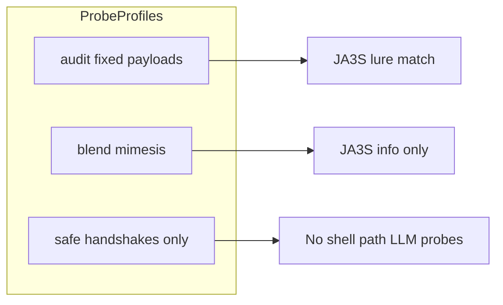
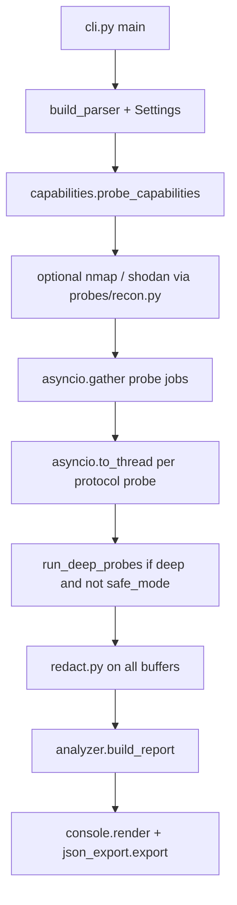
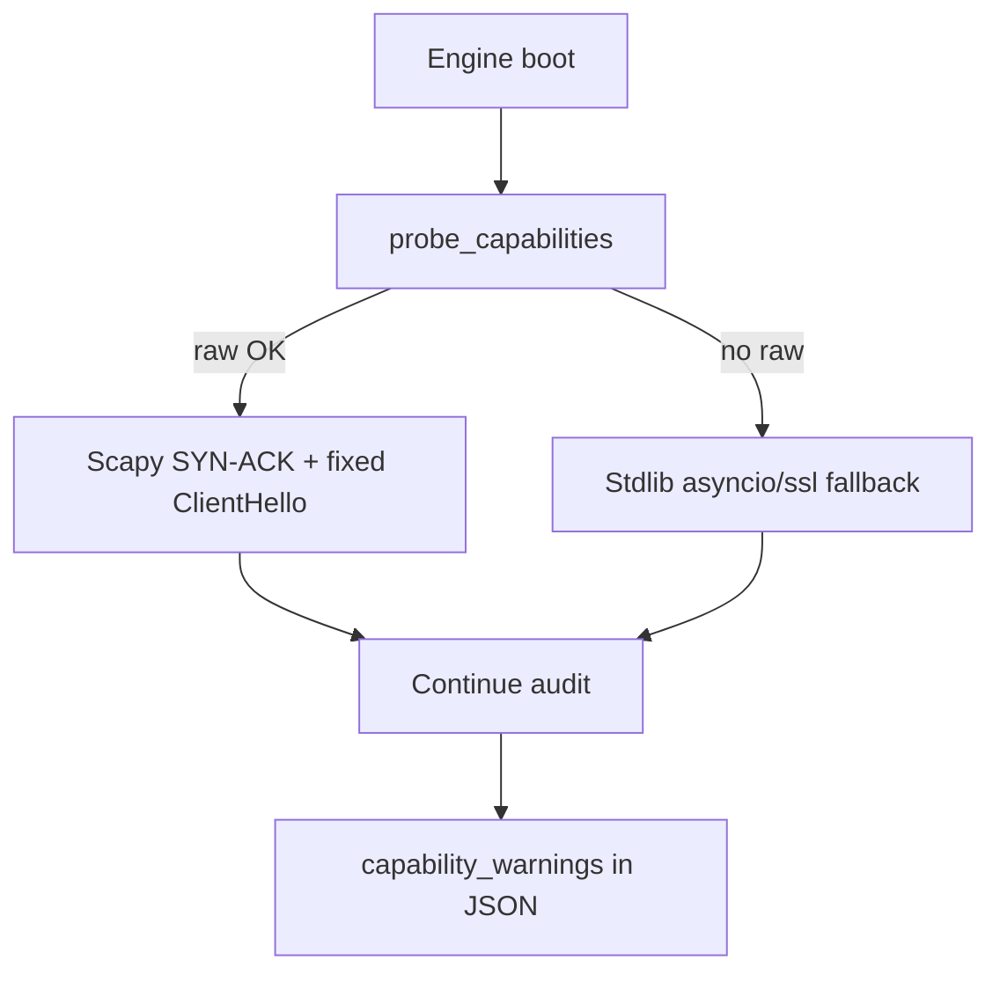

# Honeypot-Auditor: 4-Phase Roadmap (Revised)

> **Agent quick reference**: 31 tracked todos (F01–F06 foundation, P1-01–P1-08, P2-01–P2-06, P3-01–P3-05, P4-01–P4-05). Start at [Agent developer guide](#agent-developer-guide-read-before-coding). Execute in order; pass [phase gates](#phase-gates-do-not-start-next-phase-until-gate-passes) before advancing.

> **Implementation status (2026-09-01)**: All foundation + phase items are implemented. Late gap fills include `deep.clock_drift`, HTTP chunked + SSH FSM fuzz, SSH session continuity, CLI `--jitter`, `tls.wildcard_sni`, TLS section in `docs/SIGNATURES.md`, and Docker golden job (`tests/integration/test_golden.py`).

## Context and goals

Reddit feedback asks for **HTTP header ordering** and **TLS cipher/JA3-style fingerprinting**. Expert review adds: **deterministic ClientHello**, **reverse-proxy/CDN awareness**, **declarative signatures**, **dual-dimensional scoring**, and **DevSecOps exports**. Red-team review adds: **probe profiles** (audit vs blend vs safe), **passive-first OSINT**, **tactical Go/No-Go output**, and **engagement OPSEC** (proxy, jitter) — all gated by existing `**--confirm-authorized`** and documented in `[SECURITY.md](SECURITY.md)`.

### Dual audience (one tool, two authorized use cases)


| Audience                         | Goal                                                         | Primary preset / flags                                      |
| -------------------------------- | ------------------------------------------------------------ | ----------------------------------------------------------- |
| **Blue / purple (deception QA)** | Find leaks in *your* decoys before attackers do              | `--preset deception-audit --deep -v`                        |
| **Red / pentest (authorized)**   | Identify decoys fast, avoid canaries, protect operator OPSEC | `--safe-mode --passive-first --proxy …` + `tactical_action` |


Both share the same Honeyscore engine; output framing differs (`deception_leaks` vs `tactical_action`).

### Probe profiles (resolves audit determinism vs red OPSEC)

**Conflict**: Fixed ClientHello enables stable JA3S lure profiles (blue QA); randomized browser-like ClientHello hides the scanner (red OPSEC).

**Resolution** — mutually exclusive profiles via `[settings.py](src/honeypot_auditor/settings.py)` + CLI:


| Profile               | CLI               | TLS ClientHello                                         | User-Agent                   | Use                                            |
| --------------------- | ----------------- | ------------------------------------------------------- | ---------------------------- | ---------------------------------------------- |
| `**audit**` (default) | (default)         | Fixed Scapy template                                    | `honeypot-auditor/{version}` | Reproducible lure detection, CI golden tests   |
| `**blend**`           | `--profile blend` | Rotating browser-like templates (Chrome/Firefox subset) | Configurable / rotate        | Authorized red-team egress through redirectors |
| `**safe**`            | `--safe-mode`     | Handshake-only (no deep shell/path)                     | Any profile                  | Canary avoidance; minimal wire footprint       |


`blend` disables comparison against static `tls_profiles.json` lure hashes (reports JA3S as informational only). `audit` is required for deception-audit preset and CI.




### Current codebase baseline (do not re-build)


| Capability          | Already exists                                                                                             | Plan action                                                   |
| ------------------- | ---------------------------------------------------------------------------------------------------------- | ------------------------------------------------------------- |
| Probe orchestration | `[cli.py](src/honeypot_auditor/cli.py)` uses `asyncio.gather` + `asyncio.to_thread`                        | Phase 3 optimizes **socket I/O**, not top-level orchestration |
| SSH KEXINIT / HASSH | `[hassh.py](src/honeypot_auditor/hassh.py)` + `[probe_hassh](src/honeypot_auditor/probes/deep/stack.py)`   | Phase 2: export raw KEXINIT bytes in JSON; deepen algo lists  |
| TCP vs banner       | `[probe_banner_vs_stack](src/honeypot_auditor/probes/deep/stack.py)`                                       | Phase 2: formalize as first-class indicator + remediation     |
| Frozen HTTP Date    | `[http.py](src/honeypot_auditor/probes/http.py)`, `[deep/fsm.py](src/honeypot_auditor/probes/deep/fsm.py)` | Keep; extend with header order                                |
| TLS cert CN         | `[probe_tls_ja4s](src/honeypot_auditor/probes/deep/stack.py)` (misnamed)                                   | Rename; replace stdlib path with fixed ClientHello            |


### Design principles

- **TDD**: red → green → refactor; fixture bytes + negative nginx/proxy controls
- **Deterministic probes**: fixed wire payloads for TLS (and documented constants for HTTP/2 SETTINGS) so JA3S profiles are stable across auditor OS/Python/OpenSSL versions
- **Proxy-aware suppression (tiered)**: suppress **edge/L4/L7-wire** tells through detected CDN/reverse proxy; **continue scoring origin/app tells** (wildcard Host, FSM, behavior)
- **Capability degradation**: raw Scapy probes auto-downgrade when unprivileged; audit continues with warnings
- **Corroboration-gated weak tells**: stack/fingerprint indicators require another category hit
- **Deception QA framing**: `remediation` + optional `proxy_context` on indicators
- **Declarative signatures only** (Phase 4): no `match: function` hooks in community packs
- **Incremental releases**: v0.3.1 → v0.5.0
- **Authorization unchanged**: public targets still require `--confirm-authorized`; OPSEC features are not an bypass
- **Safe by default for engagement**: `--safe-mode` documented as recommended for first touch on unknown subnets

```mermaid
flowchart TB
  subgraph foundation [Foundation]
    PD[proxy_detect edge vs origin]
    CAP[capabilities.py degradation]
    HW[httpwire.py]
    MD[Indicator + AuditReport fields]
    PP[probe profiles audit blend safe]
  end
  subgraph phase1 [Phase1 v0.3.1]
    HO[HTTP header order]
    WH[Wildcard Host and SNI]
    CONF[Confidence metric]
    SAFE[safe-mode flag]
    SOCKS[socks5h proxy]
    REDACT[honeytoken redact]
    SDK[Python Auditor SDK]
    NMAPX[nmap exclude output]
    TS[TLS rename stability]
  end
  subgraph phase2 [Phase2 v0.4.0]
    FCH[Fixed ClientHello audit]
    JA3[JA3S TLS1.2 JA4S TLS1.3]
    P0F[TCP SYN-ACK options]
    PASS[passive-first OSINT]
    TACT[tactical_action matrix]
    DUAL[dual-stack IPv4 IPv6]
    REPLAY[offline socket replay CI]
    KEX[Raw KEXINIT export]
  end
  subgraph phase3 [Phase3 v0.4.1]
    H2[HTTP2 SETTINGS order]
    JIT[jitter timing]
    STATE[state continuity probe]
    ENT[Shell entropy latency]
    TRANS[ProbeTransportManager]
    GHCR[GHCR Docker image]
    BLEND[blend profile mimesis]
  end
  subgraph phase4 [Phase4 v0.5.0]
    YAML[Declarative signatures]
    CHKSIG[check-sig linter]
    PLUG[entry-point plugins]
    LLM[LLM hallucination probes]
    SARIF[SARIF export]
    GHA[GitHub Action]
  end
  foundation --> phase1 --> phase2 --> phase3 --> phase4
```




---

## Agent developer guide (read before coding)

**Repo**: `/Users/mz/Projects/honeypot-auditor` · **Current version**: v0.3.0 · **Python**: ≥3.10 · **Lint**: Ruff (CI gate)

### Execution pipeline (do not rewrite — extend)




**Key integration points** (touch these, do not fork parallel orchestrators):


| Step            | File                                                                        | Function / pattern                                                |
| --------------- | --------------------------------------------------------------------------- | ----------------------------------------------------------------- |
| CLI args        | `[cli.py](src/honeypot_auditor/cli.py)`                                     | `build_parser()`, `_run_named()`, `main()`                        |
| Global settings | `[settings.py](src/honeypot_auditor/settings.py)`                           | Extend `Settings` dataclass; today only `timeout_seconds`, `deep` |
| Probe registry  | `[probes/__init__.py](src/honeypot_auditor/probes/__init__.py)`             | `PROBE_BY_PROTOCOL` dict                                          |
| Scoring         | `[analyzer.py](src/honeypot_auditor/analyzer.py)`                           | `build_report()`, `compute_score()`, corroboration helpers        |
| Weights         | `[config.py](src/honeypot_auditor/config.py)`                               | `WEIGHTS`, `DEEP_WEIGHTS`, `PROTOCOL_STRATEGIES`                  |
| JSON export     | `[reporters/json_export.py](src/honeypot_auditor/reporters/json_export.py)` | `_report_payload()` — add new AuditReport fields here             |
| Console         | `[reporters/console.py](src/honeypot_auditor/reporters/console.py)`         | `-v` Rich panels                                                  |


### Scoring model (preserve through v0.5.0 — no Bayesian rewrite)

**Basic categories** (`[config.py](src/honeypot_auditor/config.py)` `WEIGHTS`):

- `shodan` 25% · `arbitrary_auth` 30% · `state_nonpersist` 25% · `static_signature` 20% · `cotenancy` 15%

**Deep adds 5 categories** (`DEEP_WEIGHTS`, `--deep` only):

- `behavior` 18% · `coherence` 15% · `stack_fingerprint` 12% · `proto_conformance` 12% · `temporal` 10%

**Corroboration bonus**: +5% per protocol beyond first, max +35% (`[analyzer.py](src/honeypot_auditor/analyzer.py)` `protocol_corroboration_bonus`).

**New fields do NOT replace Honeyscore** — `confidence`, `tactical_action`, `deception_leaks` are orthogonal outputs computed in `build_report()`.

### Indicator conventions

- Emit via probe modules returning `list[Indicator]`
- Categories must match keys in `WEIGHTS` / `DEEP_WEIGHTS` to affect score (except `info.*` and `corroboration.*`)
- Set `tell_tier` on new indicators: `edge` | `origin` | `behavior` — drives proxy suppression
- Set `requires_corroboration=True` for weak stack/fingerprint tells; gate in `apply_stack_corroboration()` (Phase 2)
- `Indicator.as_dict()` must include all new fields for JSON backward compatibility

### Test commands

```bash
cd /Users/mz/Projects/honeypot-auditor
pip install -e ".[dev,full]"
pytest tests/ -q                    # full suite
pytest tests/test_analyzer.py -q    # scoring changes
ruff check src tests                # CI gate (must pass)
```

**TDD order per task**: write failing test → implement → ruff → pytest → update CHANGELOG.

### Optional deps (`[pyproject.toml](pyproject.toml)`)

Add to `[full]`: `PySocks>=1.7.1`, `pyyaml>=6.0` when implementing proxy and YAML signatures. Scapy already in `[full]`.

### Phase gates (do not start next phase until gate passes)


| Gate                 | Criteria                                                                                                         |
| -------------------- | ---------------------------------------------------------------------------------------------------------------- |
| Foundation → Phase 1 | `pytest tests/test_models.py tests/test_httpwire.py tests/test_proxy_detect.py tests/test_capabilities.py` green |
| Phase 1 → Phase 2    | v0.3.1 tagged; `--safe-mode`, `--proxy`, SDK work; ruff clean                                                    |
| Phase 2 → Phase 3    | v0.4.0 tagged; TLS fingerprint + tactical_action + replay CI job green                                           |
| Phase 3 → Phase 4    | v0.4.1 tagged; transport manager + GHCR smoke test                                                               |
| Phase 4 → release    | v0.5.0 tagged; README/Pages sync checklist 4.10 complete                                                         |


---

## Foundation todo checklist (before Phase 1)

**Goal**: Shared infrastructure all phases depend on. **Do not ship a release** — merge to main as prep PR or first commit batch of v0.3.1 branch.


| ID  | Task                | Files to create/modify                                                                                                      | Acceptance criteria                                                                                                              |
| --- | ------------------- | --------------------------------------------------------------------------------------------------------------------------- | -------------------------------------------------------------------------------------------------------------------------------- |
| F01 | Extend data model   | `[models.py](src/honeypot_auditor/models.py)`, `[json_export.py](src/honeypot_auditor/reporters/json_export.py)`            | New Indicator fields in `as_dict()`; AuditReport has `confidence`, `proxy_*`, `capability_*`; JSON export includes them          |
| F02 | HTTP wire utils     | **NEW** `[httpwire.py](src/honeypot_auditor/httpwire.py)`, refactor `[probes/http.py](src/honeypot_auditor/probes/http.py)` | `parse_header_names()` preserves order; fixtures in `tests/fixtures/http/nginx.raw`, `python-trap.raw`, `cloudflare-proxied.raw` |
| F03 | Tiered proxy detect | **NEW** `[proxy_detect.py](src/honeypot_auditor/proxy_detect.py)`                                                           | `detect_proxy(signals) -> ProxyResult`; `should_suppress(indicator) -> bool` respects `tell_tier`; edge suppressed, origin not   |
| F04 | Capability probe    | **NEW** `[capabilities.py](src/honeypot_auditor/capabilities.py)`                                                           | `probe_capabilities()` returns dataclass; mock unprivileged → `raw_sockets=False`, no exception                                  |
| F05 | Probe profiles      | `[settings.py](src/honeypot_auditor/settings.py)`, `[cli.py](src/honeypot_auditor/cli.py)`                                  | `ProbeProfile` enum: AUDIT, BLEND, SAFE; `--safe-mode` sets SAFE; global `settings` pattern preserved                            |
| F06 | Doc skeletons       | **NEW** `docs/SIGNATURES.md`, `docs/DECEPTION-AUDIT.md`, `docs/SCORING.md`                                                  | Outline sections present; filled incrementally per phase                                                                         |


**Tests to create**: `tests/test_models.py`, `tests/test_httpwire.py`, `tests/test_proxy_detect.py`, `tests/test_capabilities.py`

---

## Phase 1 todo checklist (v0.3.1)

**Goal**: Quick wins + red-team engagement utilities. **Release**: bump `pyproject.toml` + `[__init__.py](src/honeypot_auditor/__init__.py)` to `0.3.1`, CHANGELOG, git tag `v0.3.1`.


| ID    | Task                   | Primary files                                                                                                                  | Acceptance criteria                                                                                                      |
| ----- | ---------------------- | ------------------------------------------------------------------------------------------------------------------------------ | ------------------------------------------------------------------------------------------------------------------------ |
| P1-01 | HTTP header-order tell | `[probes/http.py](src/honeypot_auditor/probes/http.py)`, `[config.py](src/honeypot_auditor/config.py)`                         | Indicator `http.header_order`; fires on lure order match + corroborating HTTP tell; **suppressed** when proxy_detected   |
| P1-02 | Wildcard Host          | `[probes/http.py](src/honeypot_auditor/probes/http.py)`, `[netutil.py](src/honeypot_auditor/netutil.py)`                       | `GET` with `Host: invalid.test.local`; indicator `http.wildcard_host`, `tell_tier=origin`; **still scores** behind proxy |
| P1-03 | TLS rename + stability | `[probes/deep/stack.py](src/honeypot_auditor/probes/deep/stack.py)`                                                            | `deep.tls_stack` replaces `deep.tls_ja4s`; old id alias one release; double-handshake cipher stability tell              |
| P1-04 | Confidence metric      | `[analyzer.py](src/honeypot_auditor/analyzer.py)`, `[console.py](src/honeypot_auditor/reporters/console.py)`                   | `AuditReport.confidence` = low/medium/high per heuristics; visible in JSON + `-v`                                        |
| P1-05 | Safe mode              | `[cli.py](src/honeypot_auditor/cli.py)`, `[probes/deep/__init__.py](src/honeypot_auditor/probes/deep/__init__.py)`             | `--safe-mode` forces `deep=False`; no shell/auth/path probes; `[SECURITY.md](SECURITY.md)` updated                       |
| P1-06 | Proxy + redact         | **NEW** `[proxy_transport.py](src/honeypot_auditor/proxy_transport.py)`, **NEW** `[redact.py](src/honeypot_auditor/redact.py)` | `socks5h://` enforced; `redact()` before all outputs; `info.honeytoken_detected` does not affect score                   |
| P1-07 | SDK + nmap exclude     | **NEW** `[engine.py](src/honeypot_auditor/engine.py)`, `[json_export.py](src/honeypot_auditor/reporters/json_export.py)`       | `Auditor.run()` / `run_async()`; `--output-nmap-exclude` appends IP if score ≥ 60                                        |
| P1-08 | Release                | CHANGELOG, README snippet, pyproject                                                                                           | All Phase 1 tests green; ruff clean; tag v0.3.1                                                                          |


**Tests to create/extend**: `tests/test_http.py`, `tests/test_analyzer.py`, `tests/test_cli.py`, `tests/test_engine.py`, `tests/test_redact.py`, `tests/test_proxy_transport.py`

**Depends on**: Foundation F01–F05 complete.

---

## Phase 2 todo checklist (v0.4.0)

**Goal**: Deterministic TLS, tactical output, passive-first OSINT. **Requires**: Scapy `[full]`, optional root/CAP_NET_RAW for SYN-ACK.


| ID    | Task                    | Primary files                                                                                                    | Acceptance criteria                                                                                    |
| ----- | ----------------------- | ---------------------------------------------------------------------------------------------------------------- | ------------------------------------------------------------------------------------------------------ |
| P2-01 | Fixed ClientHello       | **NEW** `[tls_fingerprint.py](src/honeypot_auditor/tls_fingerprint.py)`                                          | Golden hex stable; JA3S for TLS1.2; JA4S for TLS1.3; capability fallback to stdlib                     |
| P2-02 | probe_tls_stack rewrite | `[probes/deep/stack.py](src/honeypot_auditor/probes/deep/stack.py)`, **NEW** `data/tls_profiles.json`            | Lure profile match; edge-tier suppression via proxy_detect                                             |
| P2-03 | KEXINIT + SYN-ACK       | `[hassh.py](src/honeypot_auditor/hassh.py)`, `[probes/deep/stack.py](src/honeypot_auditor/probes/deep/stack.py)` | `raw_kexinit` in JSON; SYN-ACK options skipped gracefully without raw sockets                          |
| P2-04 | Passive + tactical      | `[probes/recon.py](src/honeypot_auditor/probes/recon.py)`, `[analyzer.py](src/honeypot_auditor/analyzer.py)`     | `--osint-only` zero TCP probes; `tactical_action` matrix (6-row priority); `tactical_rationale` string |
| P2-05 | Dual-stack + replay     | `[cli.py](src/honeypot_auditor/cli.py)`, **NEW** `tests/fixtures/replays/`, **NEW** `tests/conftest_replay.py`   | `--dual-stack` A+AAAA; `pytest -m replay` CI job; no docker required for replay tests                  |
| P2-06 | Release                 | **NEW** `[scripts/capture-tls-baseline.sh](scripts/capture-tls-baseline.sh)`                                     | Tag v0.4.0; SIGNATURES.md TLS section                                                                  |


**Tests to create/extend**: `tests/test_tls_fingerprint.py`, `tests/test_hassh.py`, `tests/test_recon.py`, `tests/test_analyzer.py` (tactical matrix parametrized), `tests/test_replay.py`

**Depends on**: Phase 1 complete; Foundation F04 capabilities wired into TLS/SYN probes.

---

## Phase 3 todo checklist (v0.4.1)

**Goal**: HTTP/2, performance, deep behavioral probes, blend profile, GHCR.


| ID    | Task               | Primary files                                                                                                                                                                                                         | Acceptance criteria                                                                            |
| ----- | ------------------ | --------------------------------------------------------------------------------------------------------------------------------------------------------------------------------------------------------------------- | ---------------------------------------------------------------------------------------------- |
| P3-01 | HTTP/2 SETTINGS    | **NEW** `[http2_fingerprint.py](src/honeypot_auditor/http2_fingerprint.py)`, `data/http2_settings_profiles.json`                                                                                                      | SETTINGS order tell; edge-tier; optional `[full]`                                              |
| P3-02 | Transport + jitter | **NEW** `[netutil_async.py](src/honeypot_auditor/netutil_async.py)`, **NEW** `[transport.py](src/honeypot_auditor/transport.py)`                                                                                      | `ProbeTransportManager` max 32 sockets; `--jitter-ms`; `--max-concurrent`; no FD leaks in test |
| P3-03 | Deep behavioral    | `[probes/deep/fsm.py](src/honeypot_auditor/probes/deep/fsm.py)`, `[probes/deep/behavior.py](src/honeypot_auditor/probes/deep/behavior.py)`, `[probes/deep/temporal.py](src/honeypot_auditor/probes/deep/temporal.py)` | State continuity cookie probe; shell entropy (not safe-mode); mtime uniformity; FSM fuzz gated |
| P3-04 | Blend + GHCR       | `[config.py](src/honeypot_auditor/config.py)`, **NEW** `Dockerfile`, **NEW** `.github/workflows/publish-ghcr.yml`                                                                                                     | `--profile blend` + `--seed N`; GHCR image builds on tag                                       |
| P3-05 | Release            | `[scripts/benchmark-lab.sh](scripts/benchmark-lab.sh)`, `[deploy/docker-compose.benchmark.yml](deploy/docker-compose.benchmark.yml)`                                                                                  | Tag v0.4.1                                                                                     |


**Tests to create/extend**: `tests/test_http2_fingerprint.py`, `tests/test_transport.py`, `tests/test_deep_modules.py`, `tests/test_fsm.py`

**Depends on**: Phase 2 TLS infrastructure (`tls_fingerprint.py`, fixed ClientHello templates for blend).

---

## Phase 4 todo checklist (v0.5.0)

**Goal**: Enterprise suite — signatures, plugins, SARIF, CI golden fixtures, full public docs sync.


| ID    | Task              | Primary files                                                                                                                                                                    | Acceptance criteria                                                                          |
| ----- | ----------------- | -------------------------------------------------------------------------------------------------------------------------------------------------------------------------------- | -------------------------------------------------------------------------------------------- |
| P4-01 | Signature engine  | **NEW** `[signatures/loader.py](src/honeypot_auditor/signatures/loader.py)`, `signatures/core/*.json`                                                                            | Declarative primitives only; `check-sig` subcommand; malicious YAML cannot exec              |
| P4-02 | Plugins + LLM     | **NEW** `[plugins/api.py](src/honeypot_auditor/plugins/api.py)`, `[probes/deep/behavior.py](src/honeypot_auditor/probes/deep/behavior.py)`                                       | Entry point loads test plugin; LLM probes experimental + corroboration-gated                 |
| P4-03 | Deception + SARIF | `[analyzer.py](src/honeypot_auditor/analyzer.py)`, **NEW** `[reporters/sarif.py](src/honeypot_auditor/reporters/sarif.py)`, `[cli.py](src/honeypot_auditor/cli.py)`              | `--preset deception-audit`; `deception_leaks` ranked JSON; `--format sarif` validates schema |
| P4-04 | GHA + golden CI   | **NEW** `[.github/action/action.yml](.github/action/action.yml)`, `.github/workflows/golden.yml`                                                                                 | actionlint passes; cowrie/dionaea/nginx assert indicator ids; nginx baseline clean           |
| P4-05 | Public docs sync  | `[README.md](README.md)`, `[docs/index.html](docs/index.html)`, `[docs/llms-full.txt](docs/llms-full.txt)`, **NEW** `[scripts/sync-public-docs.sh](scripts/sync-public-docs.sh)` | Checklist 4.10 complete; CLI flags parity; tag v0.5.0; PyPI publish                          |


**Tests to create/extend**: `tests/test_signatures.py`, `tests/test_check_sig.py`, `tests/test_plugins.py`, `tests/test_sarif.py`, `tests/integration/test_golden.py`

**Depends on**: All prior phases; replay harness (P2-05) extended for signature offline tests.

---

## Cross-cutting foundation (before Phase 1) — detailed spec

### 1. Extend data model

`[Indicator](src/honeypot_auditor/models.py)`:

- `remediation: str = ""`
- `fingerprint_type: str = ""` — `http_header_order`, `tls_ja3s`, `http2_settings`, etc.
- `requires_corroboration: bool = False`
- `suppressed: bool = False` — true when proxy_detect blocked **edge-tier** scoring only
- `suppression_reason: str = ""` — e.g. `reverse_proxy_detected`
- `tell_tier: str = "origin"` — `edge` | `origin` | `behavior` (controls proxy suppression scope)

`[AuditReport](src/honeypot_auditor/models.py)`:

- `confidence: str` — `low` | `medium` | `high` (see Phase 1.4)
- `proxy_detected: bool = False`
- `proxy_evidence: list[str] = field(default_factory=list)`
- `proxy_context: str = ""` — e.g. `edge_proxy_present` when proxy detected but origin tells still scored
- `capability_warnings: list[str] = field(default_factory=list)` — e.g. `raw_sockets_disabled`, `scapy_unavailable`
- `capabilities: dict[str, bool] = field(default_factory=dict)` — `{raw_sockets: bool, scapy_tls: bool, pysocks: bool}`

**TDD**: `[tests/test_models.py](tests/test_models.py)` (new); JSON export tests in `[tests/test_reporters.py](tests/test_reporters.py)`.

### 2. HTTP wire utilities — `[httpwire.py](src/honeypot_auditor/httpwire.py)`

- `parse_header_names(raw) -> list[str]` — preserve order + casing
- `parse_header_map(raw) -> dict` — migrate from `[http.py](src/honeypot_auditor/probes/http.py)` `_parse_headers`

**Fixtures**: `[tests/fixtures/http/](tests/fixtures/http/)` — nginx, python-trap, proxied (Via/CF-Ray/X-Forwarded-For).

### 3. Proxy / CDN pre-check — `[proxy_detect.py](src/honeypot_auditor/proxy_detect.py)` (new)

Run early in HTTP/TLS probe paths (Phase 1+):

**HTTP signals**: `Via`, `X-Forwarded-For`, `X-Forwarded-Proto`, `CF-Ray`, `X-Amz-Cf-Id`, `X-Cache`, `Server: cloudflare|AkamaiGHost|AmazonS3`, `Alt-Svc` with CDN patterns.

**TLS signals** (Phase 2+): JA3S matches known CDN edge profiles in `data/cdn_tls_profiles.json`; cert SAN wildcard CDN CNs.

**Tiered suppression** (fixes cascading false-negative risk):


| Tell tier        | Examples                                                                                                                         | When `proxy_detected=True`                                              |
| ---------------- | -------------------------------------------------------------------------------------------------------------------------------- | ----------------------------------------------------------------------- |
| **Edge / wire**  | `http_header_order`, `tls_ja3s`, `tls_cipher`, `http2_settings`, `deep.tcp_synack_options`, `tls.wildcard_sni` (edge-terminated) | **Suppress scoring** — `suppressed=True`, `triggered=False`             |
| **Origin / app** | `http.wildcard_host`, FSM failures, shell entropy, LLM probes, `fsm.stateless_trap_behavior`, co-tenancy                         | **Continue scoring** — tag report `proxy_context: "edge_proxy_present"` |
| **Behavior**     | auth quirks, temporal, mtime uniformity                                                                                          | **Continue scoring**                                                    |


**Behavior**:

- Set `AuditReport.proxy_detected = True`, `proxy_context = "edge_proxy_present"`, accumulate `proxy_evidence`
- Edge-tier indicators only → suppressed with detail `(suppressed: reverse proxy/CDN detected — origin tells still active)`
- Phase 4 `deception_leaks`: list suppressed edge tells separately; rank origin tells normally

**TDD**: proxied nginx fixture — header-order suppressed **but** wildcard-host still fires on trap skin; assert Honeyscore can still exceed threshold while `tactical_action=INCONCLUSIVE`.

### 3b. Capability degradation pipeline — `[capabilities.py](src/honeypot_auditor/capabilities.py)` (new)

**Problem**: Scapy raw SYN-ACK (Phase 2.9) and fixed ClientHello framing require `CAP_NET_RAW` / root on Linux/macOS. Unprivileged `pip install` users must not crash.

**Boot probe** (engine init in `[cli.py](src/honeypot_auditor/cli.py)` or `Auditor` class):

```python
def probe_capabilities() -> Capabilities:
    raw_ok = _probe_raw_socket()  # try SOCK_RAW or geteuid()==0
    scapy_ok = importlib.util.find_spec("scapy") is not None and raw_ok
    return Capabilities(raw_sockets=raw_ok, scapy_tls=scapy_ok, ...)
```

**Degradation rules**:


| Missing capability    | Fallback                                              | Report field                                    |
| --------------------- | ----------------------------------------------------- | ----------------------------------------------- |
| `raw_sockets`         | Skip SYN-ACK option probe; stdlib TCP banner/TTL only | `capability_warnings: ["raw_sockets_disabled"]` |
| `scapy` (no `[full]`) | stdlib `ssl` for cert CN; JA3S informational only     | `capability_warnings: ["scapy_unavailable"]`    |
| `PySocks`             | `--proxy` raises clear error with install hint        | exit 2 before probes                            |


Audit **never halts** due to missing privileges — skip raw-dependent checks and continue.




**TDD**: mock unprivileged environment; assert SYN-ACK probe skipped, HTTP probes run, warnings present.

### 4. Dependency & capability matrix


| Component                   | Standard (`pip install honeypot-auditor`) | Full (`[full]`)        | Unprivileged fallback            |
| --------------------------- | ----------------------------------------- | ---------------------- | -------------------------------- |
| Core probes                 | stdlib `asyncio`, `ssl`, `json`           | stdlib                 | Full banner/header/basic TLS     |
| Raw Scapy / TLS fingerprint | Skipped                                   | `scapy>=2.5.0`         | stdlib `ssl`; JA3S informational |
| Proxy transport             | `--proxy` errors with hint                | `PySocks>=1.7.1`       | N/A                              |
| YAML signatures             | core `.json` only                         | `pyyaml>=6.0`          | JSON packs only                  |
| SSH/SMB deep                | threaded stdlib sockets                   | `paramiko`, `impacket` | banner grab fallback             |


Document in `[README.md](README.md)` install table and `[docs/SCORING.md](docs/SCORING.md)`.

### 5. Documentation skeleton


| Doc                                                  | Purpose                                        |
| ---------------------------------------------------- | ---------------------------------------------- |
| `[docs/SIGNATURES.md](docs/SIGNATURES.md)`           | FP policy, proxy rules, declarative schema     |
| `[docs/DECEPTION-AUDIT.md](docs/DECEPTION-AUDIT.md)` | Blue/purple workflow, Honeyscore vs Confidence |
| `[docs/SCORING.md](docs/SCORING.md)` (new)           | Honeyscore + Confidence derivation             |
| `[CHANGELOG.md](CHANGELOG.md)`                       | Per-release notes                              |


---

## Phase 1 — Quick wins (target: **v0.3.1**)

### 1.1 HTTP response header-order tell

Same as prior plan, with **proxy_detect gate** applied before scoring.

Fire `http.header_order` only when: lure order match **and** corroborating HTTP tell **and** `not proxy_detected`.

### 1.2 Wildcard Host header and SNI acceptance (NEW — review)

High-confidence behavioral tell for catch-all Python/web decoys.

**HTTP**: Raw GET with `Host: invalid.test.local` (or RFC6761 `.invalid` name). Production nginx/apache often 400/421/444; traps often 200/login skin/redirect anyway.

**TLS** (443/8443): ClientHello with SNI `invalid.test.local` via fixed payload (Phase 2 shares ClientHello builder); note cert presented vs SNI mismatch acceptance.

- Indicator: `http.wildcard_host` / `tls.wildcard_sni` — category `proto_conformance`; `tell_tier=origin` (HTTP) / `edge` (TLS SNI at CDN)
- **HTTP wildcard host is NOT suppressed** when proxy detected (origin/app tell)
- TLS wildcard SNI suppressed only when edge-terminated (CDN)

**TDD**: fixtures for nginx 400 vs python-trap 200; proxied trap — header-order suppressed, wildcard-host still scores.

### 1.3 TLS probe honesty + cipher stability

- Rename `deep.tls_ja4s` → `deep.tls_stack` (deprecation alias one release)
- Double-handshake cipher tuple stability + stock cert (`[match_tls_stock_cert](src/honeypot_auditor/config.py)`)
- Apply `proxy_detect` suppression on TLS stack tells when CDN detected

### 1.4 Dual-dimensional scoring — Honeyscore + Confidence (NEW — review)

Keep **Honeyscore (0–100%)** unchanged.

Add **Confidence: low | medium | high** derived from audit breadth (not a second score):


| Level      | Heuristic                                                                               |
| ---------- | --------------------------------------------------------------------------------------- |
| **Low**    | Fewer than 3 protocols attempted, or single indicator triggered, or >50% probes skipped |
| **Medium** | 3+ protocols attempted, 2+ categories or corroboration bonus eligible                   |
| **High**   | 5+ protocol lures hit, or deep mode with 3+ deep categories, or deception-audit preset  |


Implement in `[analyzer.py](src/honeypot_auditor/analyzer.py)` `build_report()`; expose in JSON + `-v` panel (`[reporters/console.py](src/honeypot_auditor/reporters/console.py)`).

**TDD**: `[tests/test_analyzer.py](tests/test_analyzer.py)` — trapster two-protocol → medium; buffet → high.

### 1.5 Remediation strings

Populate on HTTP/TLS/SSH/MySQL indicators touched in Phase 1.

### 1.6 Red-team engagement utilities (NEW)

#### 1.6a `--safe-mode` (canary tripwire avoidance)

**Behavior** (`[cli.py](src/honeypot_auditor/cli.py)` + `[settings.py](src/honeypot_auditor/settings.py)`):

- Forces `deep=False` even if `--deep` passed (warn on stderr)
- HTTP: raw GET `/` + HEAD only — no path enumeration
- SSH/Telnet: banner + KEXINIT only — **no** auth, no shell, no `/tmp` canary
- FTP/Redis/etc.: pre-auth handshake phase only

**TDD**: `test_safe_mode_disables_deep_shell_probes`. Update `[SECURITY.md](SECURITY.md)`.

#### 1.6b SOCKS5 / proxy egress (`--proxy`) — remote DNS enforced

**CLI**: `--proxy socks5h://host:port` via `[proxy_transport.py](src/honeypot_auditor/proxy_transport.py)` (optional `PySocks` in `[full]`).

**DNS leak prevention** (critical OPSEC):

- **Accept only** `socks5h://` (remote DNS) or auto-upgrade bare `socks5://` hostnames to `socks5h://` with stderr notice
- **Reject** `socks5://` when target is a hostname unless `--proxy-allow-local-dns` explicitly passed (local `gethostbyname` leaks to operator DNS)
- IP literal targets may use either scheme
- JSON notes `egress_proxy` (never log credentials); env var `HONEYPOT_AUDITOR_PROXY` alternative
- Does not replace `--confirm-authorized`

**TDD**: mock PySocks; assert hostname targets use remote resolution; assert validation error on `socks5://` + hostname without override.

#### 1.6c Nmap exclude list export

**CLI**: `--output-nmap-exclude path.txt` — append IPs with Honeyscore ≥ 60 (subnet-aware).

**TDD**: reporter format test.

#### 1.6d Honeytoken redaction guard — `[redact.py](src/honeypot_auditor/redact.py)` (NEW)

**Problem**: Decoys embed synthetic AWS keys, JWTs, SSH private keys, DB connection strings in HTTP/error payloads. Logging or exporting these can trip SOC canaries.

**Behavior**:

- Scan all inbound socket buffers **before** console, log, or JSON export
- Redact matches to `[REDACTED_HONEYTOKEN]` using pattern list (AWS AKIA*, JWT `eyJ…`, PEM blocks, common DB URI schemes)
- Emit informational indicator `info.honeytoken_detected` (category `static_signature`, **does not increase Honeyscore** — awareness only)
- Never write raw honeytoken values to `-o` JSON, SARIF, or stderr (even with `-v`)

**TDD**: fixture HTTP body with fake AKIA key → JSON export contains redacted placeholder; indicator present.

#### 1.6e Python SDK — `[engine.py](src/honeypot_auditor/engine.py)` (NEW)

Decouple execution from CLI for SOAR/script use (low-effort refactor of existing `cli.py` orchestration):

```python
from honeypot_auditor import Auditor, ProbeProfile

auditor = Auditor(
    target="192.168.1.50",
    profile=ProbeProfile.SAFE,
    proxy="socks5h://127.0.0.1:9050",
)
report = auditor.run()           # sync wrapper
report = await auditor.run_async()  # native async
```

- `Auditor` accepts same options as CLI (`Settings` dataclass)
- Returns strongly-typed `AuditReport`
- CLI becomes thin wrapper: parse args → `Auditor(...).run()`

**TDD**: `[tests/test_engine.py](tests/test_engine.py)` — mock probes; assert `tactical_action` accessible without subprocess.

### 1.7 Docs + tag v0.3.1

- CHANGELOG `[0.3.1]`, README engagement one-liner, SECURITY.md safe-mode/proxy sections

## Phase 2 — Deterministic TLS + SSH stack depth (target: **v0.4.0**)

### 2.1 Fixed ClientHello via Scapy (CRITICAL — review)

**Problem**: stdlib `ssl` ClientHello varies by OS/OpenSSL → JA3S of target fluctuates → lure profiles invalid.

**Fix** in `[tls_fingerprint.py](src/honeypot_auditor/tls_fingerprint.py)`:

- `build_client_hello(version, ciphers, extensions, sni) -> bytes` — **constant byte template** (document hex in tests)
- `read_server_hello(raw) -> ServerHelloParsed`
- `compute_ja3s(parsed) -> str` — **TLS 1.2 ServerHello only** (cleartext extensions)
- `compute_ja4s(parsed) -> str` — **TLS 1.3+** (EncryptedExtensions not used; fingerprint cleartext negotiated params per JA4S spec)
- **Never** use `ssl.create_default_context().wrap_socket()` for fingerprinting (cert peek ok for CN tell only)

**TLS version routing**:


| Negotiated | Lure profile match                         | Display                                                             |
| ---------- | ------------------------------------------ | ------------------------------------------------------------------- |
| TLS 1.2    | JA3S vs `tls_profiles.json`                | `ja3s` + match result                                               |
| TLS 1.3    | JA4S vs `tls_profiles.json` (JA4S entries) | `ja4s` + match result; JA3S omitted or `n/a (encrypted extensions)` |


**TDD**:

- Same fixture ServerHello → same JA3S on Linux/macOS CI matrix (3.10–3.14)
- `test_client_hello_bytes_stable` — golden hex snapshot
- TLS 1.3 fixture → JA4S computed, JA3S lure match skipped with documented reason

### 2.2 Replace `probe_tls_stack`

Wire fixed ClientHello → JA3S → compare `data/tls_profiles.json` lure profiles.

Set `requires_corroboration=True` unless wildcard SNI + stock cert combo.

Apply `proxy_detect` + CDN JA3S profile suppression.

### 2.3 Raw SSH KEXINIT export (NEW — review)

Extend existing `[capture_server_kexinit](src/honeypot_auditor/hassh.py)`:

- Add `kexinit_raw_hex` to indicator `evidence` / JSON field `raw_kexinit`
- Optional indicator `deep.kexinit_rigid` when KEX algo list matches Paramiko/Twisted trap templates (data-driven)

**TDD**: extend `[tests/test_hassh.py](tests/test_hassh.py)` with Cowrie-class KEX fixture bytes.

### 2.4 TCP stack vs application-layer mismatch (enhance existing)

Formalize `[probe_banner_vs_stack](src/honeypot_auditor/probes/deep/stack.py)`:

- Document as deception-engineer tell with remediation: "Banner claims Windows but TTL/window suggests Linux"
- Add to `COTENANCY_CORROBORATION_CATEGORIES` if not already contributing

### 2.5 Stack corroboration gate

`[apply_stack_corroboration()](src/honeypot_auditor/analyzer.py)` — suppress `requires_corroboration` indicators without corroborating tell.

### 2.7 Passive-first / OSINT gate (NEW — red team)

**CLI**: `--passive-first` (alias `--osint-only` for strict mode)

**Behavior** (`[probes/recon.py](src/honeypot_auditor/probes/recon.py)` + `[cli.py](src/honeypot_auditor/cli.py)`):

1. Run Shodan Honeyscore + host tags + **port count / banner history** (existing API)
2. Score passive-only preliminary Honeyscore
3. If `--osint-only`: emit JSON + `tactical_action` and **exit 0 without TCP probes** (except optional `--passive-first-confirm` to run `--safe-mode` active verify)
4. If `--passive-first` (default passive-then-active): skip full preset when passive score ≥ 60 and port buffet pattern matches (≥8 historically open services with identical product strings); else run active probes (respecting `--safe-mode`)

**Phase 2 scope**: Shodan only (already integrated). **Backlog**: Censys/GreyNoise optional providers behind `--censys-key` / `--greynoise-key`.

**TDD**: mock Shodan responses; assert zero `tcp_transact` calls in `--osint-only`.

### 2.8 Tactical action output — formal resolution matrix (NEW — red team)

Add `tactical_action` + `tactical_rationale` to `[AuditReport](src/honeypot_auditor/models.py)` + JSON + `-v` summary panel.

**Decision hierarchy** (Honeyscore × Confidence × proxy — evaluated in order):


| Priority | Honeyscore | Confidence  | Proxy?  | Tactical Action   | Rationale                                                        |
| -------- | ---------- | ----------- | ------- | ----------------- | ---------------------------------------------------------------- |
| 1        | Any        | Any         | **Yes** | `INCONCLUSIVE`    | Edge proxy masks L4/TLS origin; use origin tells + manual verify |
| 2        | ≥ 60%      | High/Medium | No      | `SKIP_TARGET`     | High-confidence decoy signature                                  |
| 3        | ≥ 60%      | **Low**     | No      | `PROCEED_CAUTION` | High score from limited probe breadth — verify manually          |
| 4        | < 30%      | High/Medium | No      | `PIVOT_POSSIBLE`  | Production-like behavior across protocols                        |
| 5        | 30–59%     | Any         | No      | `PROCEED_CAUTION` | Ambiguous — partial decoy signals                                |
| 6        | Any        | Any         | No      | `INCONCLUSIVE`    | threat_level Inconclusive or >50% probes skipped                 |


**Note**: Honeyscore may be high behind a proxy (origin tells) while `tactical_action=INCONCLUSIVE` — by design.

Also emit `tactical_rationale: str` (one sentence) for operators.

**TDD**: `[tests/test_analyzer.py](tests/test_analyzer.py)` — matrix rows as parametrized cases; proxied trap with high Honeyscore → INCONCLUSIVE.

**Docs**: `[docs/SCORING.md](docs/SCORING.md)` — blue teams use `deception_leaks`; red teams use `tactical_action`.

### 2.9 TCP SYN-ACK option order (p0f-style) (NEW — enhances 2.4)

Extend `[probe_tcp_stack](src/honeypot_auditor/probes/deep/stack.py)` with Scapy SYN → parse SYN-ACK **option order** (MSS, WScale, SACK, Timestamp, NOP):

- Build signature string; compare to OS family implied by application banner
- Indicator: `deep.tcp_synack_options` — category `stack_fingerprint`; `tell_tier=edge`; corroboration-gated
- **Skipped** when `capabilities.raw_sockets=False` (not error)
- Suppress scoring if `proxy_detected` (edge terminates TCP)

**TDD**: fixture PCAP bytes or synthesized SYN-ACK hex in `[tests/fixtures/tcp/](tests/fixtures/tcp/)`; unprivileged mock skips probe with warning.

### 2.10 Dual-stack IPv4/IPv6 parity (`--dual-stack`) (NEW)

**CLI**: `--dual-stack` — resolve A + AAAA for hostname targets; run parallel probe passes on both addresses.

- Compare Honeyscores and banner/protocol sets
- Indicator: `info.ip_version_mismatch` when divergence exceeds threshold (e.g. IPv4 Cowrie vs IPv6 real sshd)
- Category: `coherence`; `tell_tier=origin`
- Report embeds `dual_stack: {ipv4: AuditSummary, ipv6: AuditSummary}` sub-object in JSON

**TDD**: mock DNS + divergent fixtures; assert mismatch indicator fires.

### 2.11 Offline socket replay test harness (NEW)

**Problem**: Docker-only CI is slow and flaky for 16-protocol matrix.

**Fix**: `[tests/fixtures/replays/](tests/fixtures/replays/)` + pytest fixture `replay_socket`:

- Intercept `socket.socket.connect/send/recv` (and async equivalents)
- Replay recorded TCP stream bytes per protocol (HTTP, TLS handshakes, FTP, SSH banner)
- Hermetic unit tests run in **sub-second** time without network or Docker

**Scope Phase 2**: HTTP header-order, TLS ServerHello parse, FTP banner, SSH KEXINIT bytes.

**Phase 4**: extend replays for signature `check-sig` offline validation.

**TDD**: CI job `pytest tests/unit -m replay` (no docker); integration job keeps docker golden tests.

### 2.12 Lab capture

`[scripts/capture-tls-baseline.sh](scripts/capture-tls-baseline.sh)` — uses **fixed ClientHello** only; output `data/tls_profiles.json` + `data/cdn_tls_profiles.json`.

### 2.13 Docs

- `[docs/SIGNATURES.md](docs/SIGNATURES.md)` — TLS, passive-first, tactical_action
- CHANGELOG `[0.4.0]`

---

## Phase 3 — HTTP/2 + performance + temporal + engagement OPSEC (target: **v0.4.1**)

### 3.1 Header-order corpus + HTTPS wire-order

Prior plan + nginx service in `[deploy/docker-compose.benchmark.yml](deploy/docker-compose.benchmark.yml)`.

All header-order tells pass through `proxy_detect`.

### 3.2 HTTP/2 SETTINGS frame fingerprinting (NEW — review)

New `[http2_fingerprint.py](src/honeypot_auditor/http2_fingerprint.py)` (optional `[full]` if Scapy/h2 needed):

- ALPN `h2` on fixed TLS ClientHello
- Parse server SETTINGS frame parameter **order** (e.g. `HEADER_TABLE_SIZE`, `MAX_CONCURRENT_STREAMS`, `INITIAL_WINDOW_SIZE`)
- Compare to profiles in `data/http2_settings_profiles.json`
- Category: `stack_fingerprint` or `proto_conformance`; `requires_corroboration=True`; suppress if proxy detected

**TDD**: fixture SETTINGS frames from nghttp2/nginx vs minimal Python h2 trap.

**Note**: HTTP/3 (QUIC) deferred to v0.6 backlog — significantly more complex.

### 3.3 Probe transport manager + async socket pool (NEW — scoped)

**Clarification**: `[cli.py](src/honeypot_auditor/cli.py)` already parallelizes via `asyncio.to_thread`. Phase 3 adds `[netutil_async.py](src/honeypot_auditor/netutil_async.py)` + `[transport.py](src/honeypot_auditor/transport.py)`:

```python
class ProbeTransportManager:
    def __init__(self, max_concurrent_sockets: int = 32):
        self._semaphore = asyncio.Semaphore(max_concurrent_sockets)

    async def execute_probe(self, probe_coro, timeout: float = 5.0):
        async with self._semaphore:
            try:
                return await asyncio.wait_for(probe_coro, timeout=timeout)
            finally:
                pass  # probe coroutine owns socket cleanup
```

- **Global connection budget**: `MAX_CONCURRENT_SOCKETS=32` (configurable `--max-concurrent`) across all probes
- **Mandatory cleanup**: all raw socket reads in `try/finally` with explicit `close()` — prevent `CLOSE_WAIT` on unresponsive decoy ports
- `asyncio.open_connection` where safe; sync fallback for impacket/paramiko-heavy probes

**TDD**: mock 64 parallel probes → assert max 32 in-flight; leak test with unresponsive port fixture.

**Target**: 2–5x on high-latency targets (benchmark not CI-gated).

### 3.4 Time-skew and clock drift auditing (NEW — review)

Extend `[deep/temporal.py](src/honeypot_auditor/probes/deep/temporal.py)` + HTTP Date sampling:

- Collect HTTP `Date` (N samples), compare delta to auditor monotonic clock
- Optional SMB `SystemTime` if SMB probe active
- Flag if skew > threshold or timestamps static across samples
- Category: `temporal`; corroboration-gated

**TDD**: fixtures with frozen Date header sequence.

### 3.5 Extended boundary / fuzz testing

Extend `[deep/fsm.py](src/honeypot_auditor/probes/deep/fsm.py)`:

- Invalid HTTP chunked encoding length
- Out-of-order SSH bytes before KEXINIT (already partial in telnet FSM)
- Document as `proto_conformance` — production stacks return strict errors; traps return 200/generic

Gate: require 2+ FSM failures or corroboration.

### 3.5b Stateful session continuity probe (NEW — deep mode)

**Problem**: Low-interaction traps respond statically per connection without session memory.

**Two-stage checks** (not `--safe-mode`):

1. **HTTP**: Set-Cookie tracking — request 1 sets cookie; request 2 on same connection/session must echo cookie context (or Set-Cookie persistence)
2. **SSH**: Complete KEXINIT, drop TCP abruptly, reconnect — measure if secondary handshake timing/state differs pathologically vs production sshd

- Indicator: `fsm.stateless_trap_behavior` — category `proto_conformance`; `tell_tier=origin`; corroboration-gated
- **Not suppressed** by proxy_detect (app-layer behavior)

**TDD**: fixture trap ignoring cookies vs nginx session; SSH drop/reconnect timing mock.

### 3.6 Traffic jitter (`--jitter`) (NEW — red team OPSEC)

**CLI**: `--jitter 0.3` (fraction) or `--jitter-ms 50-500` range

- Random delay before each probe job in `[cli.py](src/honeypot_auditor/cli.py)` `_run_named` wrapper
- Default `0` (no jitter) — preserves CI speed and deception-audit reproducibility
- Document: authorized engagement only; does not replace authorization gate

**TDD**: mock time.sleep / monotonic; assert delay within bounds.

### 3.7 `--profile blend` — UA and TLS mimesis (NEW)

When `--profile blend`:

- Rotate User-Agent from curated browser list (`[config.py](src/honeypot_auditor/config.py)` `BLEND_USER_AGENTS`)
- TLS: select from 2–3 precomputed browser ClientHello templates (still **deterministic per run seed** for debugging: `--seed N`)
- JA3S reported as informational; **no** lure-profile match scoring

**TDD**: same seed → same JA3S; different seeds → different JA3S.

### 3.8 Emulated shell entropy and latency (NEW — deep only, not safe-mode)

Extend `[deep/behavior.py](src/honeypot_auditor/probes/deep/behavior.py)` (requires auth success — rare on honeypots):

- Lightweight checks only: `echo $RANDOM` variance across 3 invocations; `time head -c 512 /dev/urandom` RTT vs baseline `echo ok`
- **Blocked by `--safe-mode`** and skipped without successful auth
- Category: `behavior`; high corroboration value when triggered

**TDD**: mock shell with static vs random `$RANDOM` output.

### 3.9 Directory timestamp uniformity (NEW — deep shell)

If shell access succeeds (Cowrie lab):

- `stat` or `ls -l` on `/etc/passwd`, `/var/log`, `/usr/bin` — flag if mtimes cluster within 1s (container bake artifact)
- Category: `coherence`; remediation for blue teams

**TDD**: fixture command output with uniform timestamps.

### 3.10 Benchmark script + CI

Extend `[scripts/benchmark-lab.sh](scripts/benchmark-lab.sh)`; Dionaea HTTP header-order / Date tells.

### 3.11 GHCR Docker distribution (NEW)

Publish container image on tagged releases via GitHub Actions:

- `ghcr.io/<org>/honeypot-auditor:latest` and `:v0.4.1`
- Dockerfile: Python slim + `[full]` extras; document `--confirm-authorized` requirement
- Enables zero-Python operator runs: `docker run … honeypot-auditor --target … --safe-mode`

**TDD**: workflow builds image on PR; smoke test `--help` in container.

**Backlog**: Homebrew tap, BlackArch/Kali package requests — post v0.5.0 stability (maintenance overhead).

---

## Phase 4 — Enterprise deception suite (target: **v0.5.0**)

### 4.1 Strictly declarative signature engine (REVISED — review)

**No `match: function` or arbitrary Python hooks in contrib packs.**

`[signatures/loader.py](src/honeypot_auditor/signatures/loader.py)` supports **primitives only**:


| Primitive                 | Use                                              |
| ------------------------- | ------------------------------------------------ |
| `exact_bytes`             | FTP/MySQL canned replies                         |
| `regex`                   | Banner/substring                                 |
| `header_sequence`         | Ordered HTTP header names                        |
| `header_absent`           | Missing Date                                     |
| `ja3s_equals`             | TLS hash match                                   |
| `http2_settings_sequence` | SETTINGS ID order                                |
| `jmespath`                | JSON probe responses (MongoDB hello, Redis INFO) |


Schema validation (JSON Schema or pydantic) rejects unknown keys.

**Ship**: `signatures/core/*.json` (stdlib); `signatures/contrib/*.yaml` optional with `pyyaml` in `[full]`.

**TDD**: schema validator tests; malicious YAML cannot execute code.

Migrate 3 tells as POC (FTP desert, MySQL SSL drop, HTTP header order).

### 4.1b Signature developer linter — `check-sig` subcommand (NEW)

**CLI**: `honeypot-auditor check-sig path/to/signature.yaml`

- Validate against JSON Schema / pydantic model
- Reject banned keys (`match`, `exec`, `eval`, hooks)
- Compile-check regex patterns
- Run signature primitives against bundled test fixtures in `[tests/fixtures/signatures/](tests/fixtures/signatures/)` — **no network**

**TDD**: invalid YAML fails with actionable errors; valid community pack passes offline.

**Docs**: contributor section in `[docs/SIGNATURES.md](docs/SIGNATURES.md)`.

### 4.2 Entry-point plugin engine (NEW — complements YAML)

Use `[pyproject.toml](pyproject.toml)` entry points:

```toml
[project.entry-points."honeypot_auditor.plugins"]
trapster = "honeypot_auditor_trapster:register"
```

Plugin API (`[plugins/api.py](src/honeypot_auditor/plugins/api.py)`):

- `register_probes(registry)` — add protocol modules
- **No arbitrary code execution from YAML** — plugins are vetted PyPI packages; YAML remains declarative-only

**TDD**: dummy plugin in `tests/fixtures/plugins/` loaded in test env.

**Docs**: `[docs/PLUGINS.md](docs/PLUGINS.md)` — difference between plugins (code) and signatures (data).

### 4.3 LLM hallucination probes (NEW — experimental)

Behind `--deep` and **not** `--safe-mode`; category `behavior`:

- SSH/Telnet: `cat /sys/kernel/debug/nonexistent_hpaudit_99887`; `ls --fake-flag-x99`
- Expect standard `No such file` / `unrecognized option`; flag plausible fake success text (LLM decoys)

**Conservative scoring**: require corroboration; never alone → Confirmed.

**TDD**: fixture transcripts for rigid bash vs hallucinated output.

**Docs**: mark **experimental** in CHANGELOG; link to research notes.

### 4.4 `--preset deception-audit`

Prior plan; pairs with `--deep` documented in `[docs/DECEPTION-AUDIT.md](docs/DECEPTION-AUDIT.md)`.

`--signature-pack community` opt-in with warning banner.

### 4.5 `deception_leaks` JSON summary

```json
{
  "deception_leaks": [
    {"rank": 1, "id": "http.dynamic_headers", "remediation": "...", "severity": "medium", "suppressed": false}
  ],
  "proxy_detected": true,
  "proxy_evidence": ["CF-Ray present"],
  "confidence": "medium",
  "honeyscore": 50.0,
  "tactical_action": "PROCEED_CAUTION",
  "tactical_rationale": "Two protocol tells; not enough for skip."
}
```

Rank by category weight; include suppressed tells separately for blue-team visibility.

### 4.6 SARIF export (NEW — review)

New `[reporters/sarif.py](src/honeypot_auditor/reporters/sarif.py)`:

- `--output report.sarif` or `--format sarif` (alongside JSON)
- Map indicators → SARIF `results` with `ruleId`, `message`, `level`, `properties.remediation`
- SARIF 2.1.0; validate with schema in CI

**TDD**: golden SARIF snapshot test; optional DefectDojo field compatibility note in docs.

**Dependency**: none (stdlib `json`); no new required packages.

### 4.7 GitHub Action (NEW — review)

`[.github/action/action.yml](.github/action/action.yml)`:

```yaml
inputs:
  target: required
  preset: default deception-audit
  deep: default true
outputs:
  honeyscore, confidence, sarif-path
```

Runs `pip install honeypot-auditor[full]` + audit; uploads SARIF artifact.

**TDD**: actionlint in CI; dry-run workflow on cowrie container.

### 4.8 CI golden fixtures

Prior plan: cowrie + dionaea + nginx; assert indicator ids; **assert nginx/proxy baseline clean**.

### 4.9 Documentation pack

Prior plan + `[docs/SCORING.md](docs/SCORING.md)`, `[docs/PLUGINS.md](docs/PLUGINS.md)`, SARIF usage, GitHub Action README, **Red team engagement** section in SECURITY.md (safe-mode, passive-first, proxy, authorization).

### 4.10 Final public documentation sync — README + GitHub Pages (REQUIRED gate for v0.5.0)

**When**: After Phases 1–4 implementation is complete and **v0.5.0** is tagged — not deferred to a follow-up release.

**Goal**: Keep the two public entry points in sync so PyPI visitors, GitHub repo readers, and GitHub Pages users see the same capabilities, flags, and workflows.

#### Files to update


| Surface            | Files                                                                                                                                                                                                         |
| ------------------ | ------------------------------------------------------------------------------------------------------------------------------------------------------------------------------------------------------------- |
| **Repo README**    | `[README.md](README.md)`                                                                                                                                                                                      |
| **Public website** | `[docs/index.html](docs/index.html)`, `[docs/site.css](docs/site.css)` (if new UI patterns), `[docs/llms-full.txt](docs/llms-full.txt)`, `[docs/llms.txt](docs/llms.txt)`, `[docs/agents.md](docs/agents.md)` |


#### Content checklist (both README and `docs/index.html`)

Mirror structure between README and Pages; Pages may use collapsible **Read more** sections where tables are long.

1. **Version badge / intro** — reflect **v0.5.0** and dual-audience positioning (deception QA + authorized red decoy ID).
2. **Install table** — `pip install honeypot-auditor[full]`; optional extras (`PySocks` for proxy, `pyyaml` for community signatures).
3. **CLI flags table** — all new flags from v0.3.1–v0.5.0:
  - `--safe-mode`, `--proxy` / `socks5h://`, `--output-nmap-exclude`
  - `--passive-first`, `--osint-only`, `--dual-stack`
  - `--profile audit|blend`, `--jitter` / `--jitter-ms`, `--seed`, `--max-concurrent`
  - `--preset deception-audit`, `--signature-pack`, `--format sarif`, `check-sig` subcommand
4. **Probe profiles section** — `audit` (default), `blend`, `safe`; when to use each audience.
5. **Scoring section** — Honeyscore + **Confidence** + `**tactical_action`** values (`SKIP_TARGET`, `PIVOT_POSSIBLE`, `PROCEED_CAUTION`, `INCONCLUSIVE`); link to `[docs/SCORING.md](docs/SCORING.md)`.
6. **STRATEGIES / SUPPORTED PROTOCOLS** — update counts and categories if new tells added (HTTP/2, TCP SYN-ACK, shell entropy, LLM probes marked experimental).
7. **Output formats** — JSON fields (`deception_leaks`, `tactical_action`, `proxy_detected`, `confidence`); SARIF export; nmap exclude workflow example.
8. **Presets & workflows** — deception-audit (blue), passive-first + safe-mode (red); GitHub Action one-liner.
9. **Plugins & signatures** — link to `[docs/PLUGINS.md](docs/PLUGINS.md)` and `[docs/SIGNATURES.md](docs/SIGNATURES.md)`.
10. **SECURITY.md cross-links** — authorization, safe-mode, proxy OPSEC; no stealth-scan marketing.

#### Incremental vs final docs


| Release            | Docs expectation                                                                                                          |
| ------------------ | ------------------------------------------------------------------------------------------------------------------------- |
| **v0.3.1–v0.4.1**  | CHANGELOG + targeted README/SECURITY snippets for shipped flags only                                                      |
| **v0.5.0 (final)** | **Full README + GitHub Pages parity pass** per checklist above; regenerate `llms-full.txt` from current CLI help and docs |


**TDD / QA gate**:

- Manual diff review: every CLI flag in `--help` appears in README flags table **and** `docs/index.html` CLI FLAGS section.
- Optional script: `[scripts/sync-public-docs.sh](scripts/sync-public-docs.sh)` (Phase 4) extracts flag list from `honeypot-auditor --help` and fails CI if README/Pages tables drift.
- Verify GitHub Pages renders: strategies collapse, protocol counts, install table, no stale v0.3.0-only wording.

**Deliverable**: PR or commit titled `docs: sync README and GitHub Pages for v0.5.0` included in the v0.5.0 release branch before tag/publish.

---

## Future backlog (post v0.5.0)


| Feature                                       | Rationale for deferral                                                                              |
| --------------------------------------------- | --------------------------------------------------------------------------------------------------- |
| **Censys / GreyNoise passive providers**      | API keys + maintenance; Shodan covers Phase 2 passive-first                                         |
| **HTTP/3 QUIC fingerprinting**                | New transport; high effort                                                                          |
| **Rich TUI (`textual`)** + terminal GIF       | Marketing; defer until core metrics stable                                                          |
| **Full asyncio rewrite of Paramiko/impacket** | Risky; thread pool sufficient                                                                       |
| **Explicit honeytoken path probes**           | Rejected — safe-mode avoids; path enumeration too alert-prone                                       |
| **Bayesian log-odds scoring**                 | Defer v0.6+ — full algorithm rewrite; current weighted model stable until v0.5.0 data               |
| **Homebrew / BlackArch / Kali packages**      | Defer post v0.5.0 — GHCR covers container users first                                               |
| **Score confidence intervals (CI)**           | Defer v0.6+ — optional `honeyscore_variance` note when proxy+decoy conflict (lightweight precursor) |


---

## Release map (revised)


| Version    | Deliverables                                                                                                                                                                                           |
| ---------- | ------------------------------------------------------------------------------------------------------------------------------------------------------------------------------------------------------ |
| **v0.3.1** | Header order, wildcard Host/SNI, **tiered proxy_detect**, Confidence, **safe-mode**, **socks5h proxy**, **honeytoken redact**, **Python SDK**, nmap-exclude, **capabilities.py**, TLS rename/stability |
| **v0.4.0** | Fixed ClientHello + **capability fallback**, JA3S (TLS1.2) / JA4S (TLS1.3), TCP SYN-ACK, **passive-first**, **tactical_action matrix**, **dual-stack**, **offline replay CI**, raw KEXINIT             |
| **v0.4.1** | HTTP/2 SETTINGS, **ProbeTransportManager**, jitter, **state continuity**, shell entropy, mtime uniformity, **GHCR Docker**, blend profile, FSM fuzz                                                    |
| **v0.5.0** | Declarative signatures, `**check-sig` linter**, plugins, LLM probes (experimental), deception-audit, SARIF, GitHub Action, golden CI, **README + Pages sync**                                          |


---

## Risk register (revised)


| Risk                              | Mitigation                                                                   |
| --------------------------------- | ---------------------------------------------------------------------------- |
| JA3S varies with ClientHello      | **Fixed Scapy ClientHello** (Phase 2.1)                                      |
| TLS 1.3 encrypted extensions      | **JA3S TLS1.2 only**; **JA4S for TLS1.3** (Phase 2.1)                        |
| Unprivileged raw socket crash     | **capabilities.py** degradation pipeline (Foundation 3b)                     |
| CDN/proxy false negatives         | **Tiered suppression** — origin tells still score (Foundation 3)             |
| Proxy + high Honeyscore confusion | `tactical_action=INCONCLUSIVE` even when origin tells fire (2.8)             |
| SOCKS5 local DNS leak             | **Enforce socks5h**; reject hostname + socks5:// (Phase 1.6b)                |
| Honeytoken export triggers SOC    | **redact.py** before all outputs (Phase 1.6d)                                |
| FD exhaustion on sweeps           | **ProbeTransportManager** semaphore + finally cleanup (3.3)                  |
| YAML RCE in contrib packs         | **Declarative primitives only** + **check-sig** linter (4.1/4.1b)            |
| HTTP/2 complexity                 | Optional `[full]`; skip gracefully if no ALPN h2                             |
| Confidence metric confusion       | Document separately from Honeyscore in SCORING.md                            |
| Async socket regressions          | Sync fallback; impacket/paramiko stay threaded                               |
| OPSEC vs deterministic TLS        | **Probe profiles**: `audit` (default) vs `blend` (opt-in)                    |
| Safe-mode reduces coverage        | Document tradeoff; passive-first + safe for first pass                       |
| SOCKS5 credential leak            | Never log auth; env var `HONEYPOT_AUDITOR_PROXY` alternative                 |
| LLM probes false positives        | Experimental; corroboration required; off in safe-mode                       |
| Docs drift after 4 phases         | **4.10 final sync gate** — README + Pages parity checklist before v0.5.0 tag |
| Dual-use abuse                    | SECURITY.md + `--confirm-authorized`; no stealth-scan marketing              |


---

## TDD workflow (unchanged)

1. Spec → 2. Red (fixture) → 3. Green → 4. Refactor → 5. Negative (nginx/proxy) → 6. Integration (docker) → 7. Docs (incremental per release; **full README + Pages sync at v0.5.0**)

---

## First sprint (agent execution order)

1. **Foundation F01–F06** (models, httpwire, proxy_detect, capabilities, settings, doc skeletons)
2. **Phase 1 P1-01–P1-08** in table order (TDD each row before moving on)
3. Run phase gate: `pytest tests/ && ruff check src tests`
4. Tag **v0.3.1** only when P1-08 complete
5. Continue Phase 2 → 3 → 4; never skip phase gates

**Do not push to git or PyPI unless the user explicitly requests it.**

---

## Review verdict — all suggestions

### Blue / deception QA (prior review)


| Suggestion                    | Verdict           | Placement                       |
| ----------------------------- | ----------------- | ------------------------------- |
| Fixed ClientHello determinism | **Accept**        | Phase 2.1 (`audit` profile)     |
| Proxy/CDN pre-check           | **Accept**        | Foundation                      |
| Declarative-only YAML         | **Accept**        | Phase 4.1                       |
| HTTP/2 SETTINGS               | **Accept**        | Phase 3.2                       |
| Wildcard SNI/Host             | **Accept**        | Phase 1.2                       |
| Raw KEXINIT                   | **Accept**        | Phase 2.3                       |
| Confidence metric             | **Accept**        | Phase 1.4                       |
| SARIF export                  | **Accept**        | Phase 4.6                       |
| asyncio speedup               | **Accept scoped** | Phase 3.3                       |
| Time-skew audit               | **Accept**        | Phase 3.4                       |
| TCP vs app mismatch           | **Accept**        | Phase 2.4 + 2.9 SYN-ACK options |
| Boundary fuzz                 | **Accept**        | Phase 3.5                       |
| GitHub Action                 | **Accept**        | Phase 4.7                       |
| Rich TUI + GIF                | **Defer**         | Backlog                         |
| HTTP/3                        | **Defer**         | Backlog v0.6+                   |


### Red team / engagement (this review)


| Suggestion                         | Verdict                                               | Placement                                                       |
| ---------------------------------- | ----------------------------------------------------- | --------------------------------------------------------------- |
| SOCKS5 / proxy support             | **Accept**                                            | Phase 1.6b                                                      |
| `--safe-mode` (canary avoidance)   | **Accept** — aligns with non-destructive ethos        | Phase 1.6a                                                      |
| `--passive-first` / `--osint-only` | **Accept** — Shodan Phase 2; Censys/GreyNoise backlog | Phase 2.7                                                       |
| `tactical_action` Go/No-Go         | **Accept**                                            | Phase 2.8                                                       |
| Traffic jitter                     | **Accept**                                            | Phase 3.6                                                       |
| TLS/UA mimesis                     | **Accept scoped** — `blend` profile only; not default | Phase 3.7                                                       |
| TCP SYN-ACK option order           | **Accept** — extends p0f work                         | Phase 2.9                                                       |
| Shell entropy / urandom RTT        | **Accept scoped** — deep + not safe-mode              | Phase 3.8                                                       |
| Directory mtime uniformity         | **Accept** — deep shell only                          | Phase 3.9                                                       |
| LLM hallucination probes           | **Accept experimental**                               | Phase 4.3                                                       |
| Nmap exclude output                | **Accept** — high value, low effort                   | Phase 1.6c                                                      |
| PyPI entry-point plugins           | **Accept** — alongside YAML signatures                | Phase 4.2                                                       |
| Censys / GreyNoise OSINT           | **Defer**                                             | Backlog (after Shodan passive-first)                            |
| Explicit honeytoken path probes    | **Reject**                                            | Safe-mode + no `/aws/credentials` enumeration — too alert-prone |


### Architectural / operational (this review)


| Suggestion                                         | Verdict                                | Placement                                                            |
| -------------------------------------------------- | -------------------------------------- | -------------------------------------------------------------------- |
| Capability degradation pipeline (raw socket probe) | **Accept**                             | Foundation 3b `capabilities.py`                                      |
| Tiered proxy suppression (edge vs origin tells)    | **Accept** — fixes false-negative trap | Foundation 3 + Indicator `tell_tier`                                 |
| SOCKS5 remote DNS (`socks5h`) enforcement          | **Accept**                             | Phase 1.6b                                                           |
| TLS 1.3 JA3S limitation → JA4S routing             | **Accept**                             | Phase 2.1                                                            |
| ProbeTransportManager + FD cleanup                 | **Accept**                             | Phase 3.3                                                            |
| Formal tactical_action resolution matrix           | **Accept** — replaces loose rules      | Phase 2.8                                                            |
| Dependency & capability matrix docs                | **Accept**                             | Foundation 4                                                         |
| Python SDK (`Auditor` class)                       | **Accept**                             | Phase 1.6e                                                           |
| Offline socket replay CI harness                   | **Accept**                             | Phase 2.11                                                           |
| GHCR Docker distribution                           | **Accept**                             | Phase 3.11                                                           |
| Honeytoken redaction filter                        | **Accept**                             | Phase 1.6d `redact.py`                                               |
| Dual-stack IPv4/IPv6 (`--dual-stack`)              | **Accept**                             | Phase 2.10                                                           |
| Stateful session continuity probe                  | **Accept**                             | Phase 3.5b                                                           |
| `check-sig` developer linter                       | **Accept**                             | Phase 4.1b                                                           |
| Bayesian probabilistic scoring                     | **Defer**                              | Backlog v0.6+ — high effort; keep weighted Honeyscore through v0.5.0 |
| Homebrew / Kali / BlackArch packages               | **Defer**                              | Backlog post v0.5.0                                                  |
| Score confidence intervals                         | **Defer**                              | Backlog v0.6+ (lightweight variance note optional later)             |


